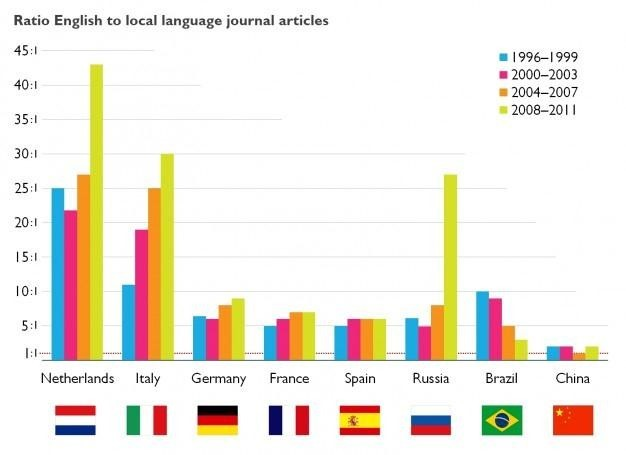
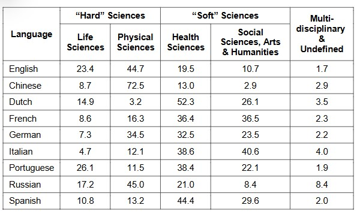
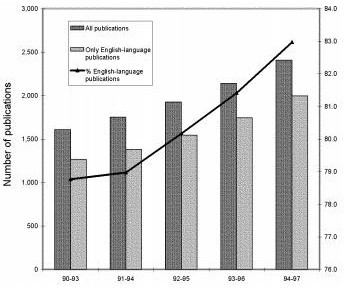
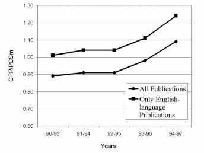
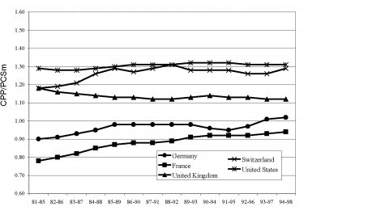

# Resultados

El inglés es considerado la lengua franca de la comunidad científica. Por ejemplo 80% de las revistas especializadas indexadas en Sopas (base de datos de investigaciones científicas) son publicadas en inglés.  Su adopción como lengua universal de las ciencias es debida en parte a factores económicos e histórico políticos, los cuales favorecieron al inglés por encima de lenguas potenciales como el alemán, chino, francés, ruso y español. TARDY (2004) establece que el alemán fue el idioma    preponderante en la primera    parte del siglo XX; el mismo autor    dice que a pesar que actualmente el inglés es el idioma principal de la comunicación científica internacional, algunos investigadores siguen publicando en otros idiomas.

En un primer estudio realizado entre 1996 y 2007, VAN WEIJEN (2012) confirmó la preferencia de los investigadores por inglés ante sus idiomas nativos en la mayoría de los países de Europa occidental incluidos en la muestra. La cantidad de publicación desde el inglés hasta el alemán y del inglés al italiano fue particularmente alta, comparada con aquellos otros países del estudio (Alemania, Francia, España y la Federación Rusa). La Fig. 2muestra el número de artículos publicados en revistas especializadas publicadas en inglés y en cada idioma oficial del país.

El análisis se extendió en un segundo estudio hacia países como Brasil y China por ser considerados por el autor como economías en ascenso investigativo, lo cual es confirmado con el hecho de que la tasa de crecimiento anual para los artículos indexados publicados en Scopus entre 1996 y 2011 en Brasil fueron del 13% y del 19% en China, lo cual es muy superior al 3 y 5% que es lo usualmente esperado (VAN WEIJEN, 2012).

La Fig.  2 muestra cómo, en contraste con el estudio original, el uso del inglés continuó aumentando fuertemente en Holanda, Italia y Rusia durante los pasados 4   años, también   se   incrementó   un   poco   en   Alemania, pero   permaneció relativamente estable en Francia, España y China.  Sin embargo, la diferencia entre el portugués y el inglés en Brasil está claramente decreciendo, aunque esto podría   ser   en   parte   a   un   incremento   en   el   cubrimiento   de   las   revistas especializadas publicadas en portugués en lugar de inglés en Sopas. Aun así, el crecimiento del uso del inglés es notorio todo el tiempo (VAN WEIJEN, 2012).

Estos resultados indican que los investigadores que    publican en inglés, chino y ruso tienden a publicar más en campos relacionados con las ciencias duras o puras como la física, ingenierías y ciencias materiales.  Por otro lado, los investigadores quienes escogen publicar en holandés, francés, italiano, portugués y español tienden a publicar sus trabajos relacionados con campos de las ciencias humanas o blandas, como las de la salud, las sociales, psicología, artes y humanidades.  Este oscila casi del 80% para Holanda e Italia y hasta 60% para Alemania y Portugal. Aunque estos rangos son similares en casi todos los países hay un alto nivel de variación en los campos actuales dentro de estas categorías. Por ejemplo, más de la mitad de toda la publicación del idioma holandés en relación con las ciencias de la salud, la cual incluye medicina, odontología, enfermería   y   veterinaria, mientras   que   en   italiano   casi   41%   de   todas   las publicaciones están relacionadas con ciencias sociales, artes y humanidades VAN WEIJEN (2012)

Continuando con la revisión, se encontró otro interesante estudio adelantado por VAN LEEUWEN et al. (2001), en esta investigación se buscó respuesta a la pregunta: ¿De qué manera se comparan el impacto de los documentos escritos en idiomas diferentes al inglés en comparación con los escritos en dicha lengua? Los resultados muestran que el 20% de todas las publicaciones de la facultad de medicina de la Universidad de Münster (Alemania) correspondía a publicaciones de   idiomas   diferentes   al   inglés   y el   80%a investigaciones   en   inglés.   Aquí encontramos otra vez el predominio del inglés incluso en la investigación de una sola   universidad. Las Figs.   3, 4y 5, se muestra   que   el   impacto   de   las publicaciones escritas en otros idiomas diferentes al inglés es más bajo. Esto los llevó a la conclusión de que el impacto de las investigaciones de esa facultad de medicina   se   incrementa debido   al promedio   del   nivel   mundial ya   que los documentos están escritos   en   inglés.   Las   siguientes   figuras   relacionan   los resultados de las investigaciones de cinco países: Estados Unidos, Reino Unido, Francia, Alemania y Suiza en el periodo 1981-1998.  Los resultados del análisis indican claramente la modesta posición de Alemania y Francia. Alemania alcanza un impacto ligeramente superior al nivel mundial solamente en el más reciente bloque de años (VAN WEIJEN; 2012).
